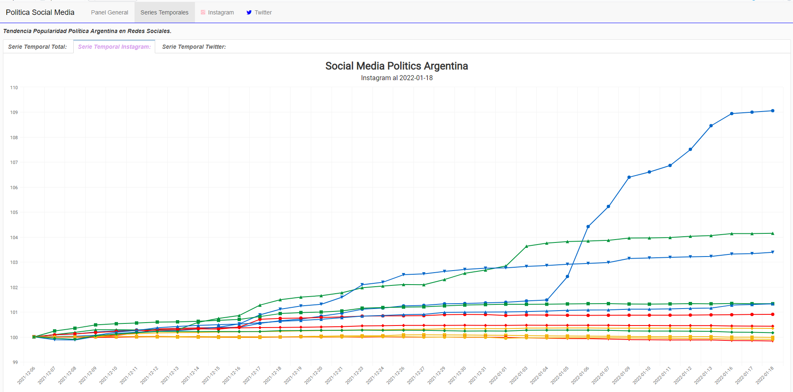
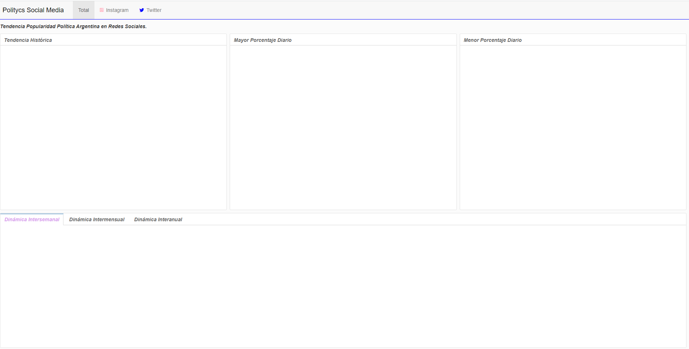

# Analytics Social Media

_This work consists of automating the data extraction using Python of the followers of the main and potential politicians of Argentina on Instagram and Twitter in order to be able to analyze trends and draw conclusions regarding future elections. The data began to be collected from the swearing-in of the Chamber of Deputies in December 2021. The dashboard will be made in R using the flexdashboard library._

# Include

<ui>

<li>
Descriptive statistics
</li>

<li>
Inferential statistics
</li>

<li>
Display
</li>

<li>
Automation
</li>

</ui>

# Programmin languages

<ui>

<li>
R (For the Dashboard)
</li>

<li>
Python (ETL)
</li>

</ui>

# R libraries

<ui>

<li>
{plotly}
</li>

<li>
{highcharter}
</li>

<li>
{tidyverse}
</li>

</ui>

# Python libraries

<ui>

<li>
{selenium}
</li>

<li>
{tweepy}
</li>

<li>
{pandas}
</li>

<li>
{datetime}
</li>

<li>
{BeautifulSoup}
</li>

</ui>

## Time Series in Levels

## Structure

# Estructura del FlexDAshBoard

Se utilizara el Theme bootstrap

